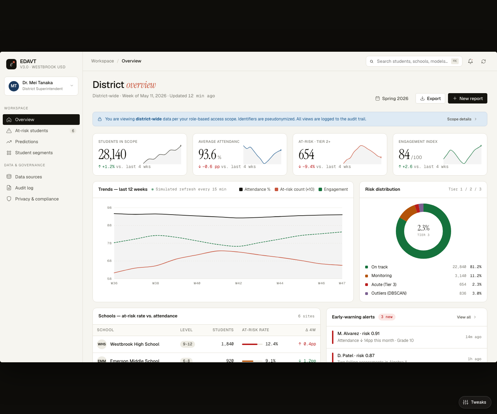

# EDAVT Prototype

**Educational Data Analysis and Visualization Tool (EDAVT)** is a high-fidelity prototype for a standards-based education analytics platform. It demonstrates how school districts, counselors, teachers, researchers, and administrators could use role-scoped dashboards, early-warning analytics, explainable risk scores, audit logging, and privacy controls to support data-informed student interventions.

Live demo: https://arham-saif.github.io/edavt-prototype/

> Status: working public prototype. This repository contains a static UI prototype with synthetic demonstration data. It does not contain real student records, production credentials, private district materials, or confidential source materials.

## Why This Repository Exists

This repository hosts the EDAVT product prototype and supporting technical documentation. It is intended to show:

- a working interface prototype rather than a purely conceptual proposal;
- synthetic sample workflows for multiple education roles;
- an architecture direction grounded in education interoperability standards;
- a privacy-forward design that treats role scope, pseudonymization, audit trails, and consent workflows as first-class product requirements;
- an open-source community-edition path for under-resourced districts.

## Prototype Features

- **District overview:** KPI cards, attendance trends, risk distribution, school breakdowns, early-warning alerts, and privacy posture.
- **At-risk student triage:** synthetic risk scores, intervention status, caseworker fields, and SHAP-style feature explanation.
- **Predictions:** forecast bands and model metadata for dropout and engagement risk.
- **Student segments:** cohort clustering and outlier detection using synthetic segment data.
- **Data sources:** Ed-Fi, OneRoster, LTI, xAPI, QTI, CSV, and SFTP connector examples.
- **Audit log:** role, action, scope, timestamp, and review flags for privacy-accountable access.
- **Privacy and compliance:** prototype control mapping for FERPA, COPPA, state privacy laws, SOC 2 roadmap planning, and NIST alignment.
- **Role switching:** district superintendent, school principal, guidance counselor, classroom teacher, and institutional researcher views.
- **Accessibility-focused shell:** semantic navigation landmarks, skip link, visible keyboard focus states, screen-reader labels, reduced-motion handling, and higher-contrast UI tokens.

## Quick Start

This prototype is a static browser app that uses CDN-hosted React and Babel. No build step is required.

```bash
python3 -m http.server 8000
```

Then open:

```text
http://localhost:8000
```

You can also open `index.html` directly in a browser, though a local static server is closer to the GitHub Pages environment.

## Repository Contents

- `index.html` - static entrypoint.
- `app.jsx`, `views/`, `charts.jsx`, `data.jsx` - prototype UI and synthetic data.
- `styles.css` - visual system and responsive stage behavior.
- `screenshots/` - stable screenshots of the main views.
- `docs/project-artifacts.md` - guide to the prototype artifacts in this repository.
- `docs/architecture-summary.md` - implementation-oriented architecture summary.
- `docs/deployment-plan-summary.md` - rollout, training, and adoption plan summary.
- `docs/competitive-analysis-summary.md` - differentiation from incumbent education analytics platforms.
- `docs/data-provenance.md` - synthetic data disclosure and non-use of student records.
- `docs/privacy-security.md` - privacy and security design principles.
- `docs/roadmap.md` - staged development roadmap.
- `docs/citations.md` - official and standards-body references.

## Screenshots



Additional screenshots are available in [`screenshots/`](screenshots/).

## Data Disclosure

All names, schools, student identifiers, risk scores, audit entries, compliance rows, connector records, and operational metrics in this repository are synthetic demonstration data. They are not taken from any real student, district, university, employer, or government system.

## Development Status

Completed in this prototype:

- interactive dashboard shell;
- seven primary views;
- role switching and role-scoped UI messaging;
- synthetic early-warning, prediction, segmentation, connector, audit, and compliance datasets;
- screenshots and documentation.

In active development:

- live data wiring against public or synthetic benchmark datasets;
- model-validation notebook and metrics report;
- deployment templates for the community edition;
- packaged open-source release process.

Planned:

- production-grade API layer;
- real pilot data integrations subject to written agreements and privacy review;
- SOC 2 readiness work and independent security testing before any production deployment;
- expanded state privacy modules.

## License

Apache License 2.0. See [`LICENSE`](LICENSE).
